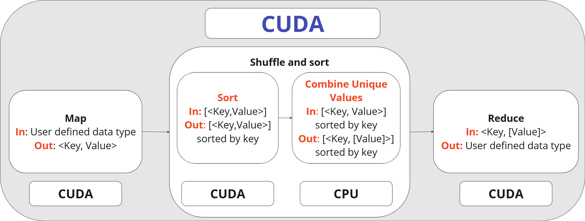

# MapReduce with CUDA

## System description

### Map-Reduce

#### Map Kernel

The Map kernel applies a specified operation or function to each element of an input array in parallel. Utilizing the massively parallel architecture of GPUs, this kernel efficiently distributes the workload across numerous threads, enabling simultaneous computation on multiple data
elements. Output is a <key, value> pair.

#### Shuffle and Sort Kernel

The Shuffle and Sort kernel arranges the processed data elements into a desired order, typically sorting them by key based on a specified criterion. By employing parallel sorting algorithms optimized for GPU architectures, this kernel organizes the data efficiently, facilitating subsequent analysis or retrieval operations. The output is <key,[values]>.

#### Reduce Kernel

The Reduce kernel aggregates the results obtained from the Map kernel by performing a reduction operation, such as summation or finding the maximum value. Through parallel reduction techniques, this kernel efficiently combines intermediate results to produce a single output
value for each key.

## Block Diagram



## Implementation

Map and Reduce functions are user-defined, with a given signature for both functions. The user is also able to specify his data structures based on his problem definition.  
A data file path is provided via command line arguments, the file is automatically read and then fed to the pipeline specified in the block diagram.

### CPU

Developed a multithreaded implementation for the Map-Reduce
algorithm on the CPU. Data is distributed based on the number of threads provided; each thread executes either the map or the reduce function on its assigned subset of data.  
The shuffle and sort phases are applied during the process.
All tests are conducted using a single thread for both mapping and reducing to assess the potential improvements offered by the GPU version.

### GPU

Developing a CUDA implementation for Map-Reduce on GPU. Each thread executes a map function for a given input. The resulting output is then fed into a CUDA implementation of either Merge Sort or Bitonic Sort, based on user preference.
Subsequently, unique keys are consolidated on the CPU.
Each key is then routed to the reducer, with options for either:

- Applying a parallel reduction kernel for each key.
- Assigning each thread to process one output element.
As per the user's choice.  
We also utilized streaming, shared memory, and pinned memory,
with coalescing memory access and control divergence in mind.

#### Configurable parameters

    1. User-defined map function.
    2. User-defined reduce function.
    3. Map block size (grid size is calculated automatically such that each thread handles one output element).
    4. Reduce block size (grid size is calculated automatically based on the next choice).
    5. Whether to make each thread calculate one output element at reduce or use reduction techniques (which automatically calculates block size and grid size based on the input size, and sends the size of the shared memory array).
    6. Expected number of output elements (with the option to be automatically inferred from the number of unique keys).
    7. Number of iterations.
    8. The user-defined data type for map key-value pair.
    9. The user-defined data type for shuffling and sorting key-value pairs.
    10. The user-defined data type for reduced output.
    11. User-defined operators (<,>,<=, etc.) for each data type.
    12. The option to prepopulate output values before starting the algorithm.  

These parameters are provided via a config.cuh (ex:kmeans.cuh,
wordcount.cuh) file and included in the main map_reduce.cu file.

## Experiments and results

### Problems Tested

#### K-Means

- Data size = 2^15 points
- Dimensions = 2
- Iterations = 2
- K = 50
- MAP_BLOCK_SIZE = 512
- MAP_GRID_SIZE = (NUM_INPUT + MAP_BLOCK_SIZE - 1) /
- MAP_BLOCK_SIZE = (2^15 + 512- 1) / 512 = 64
- REDUCE_BLOCK_SIZE = 32
- REDUCE_GRID_SIZE = (NUM_OUTPUT +
- REDUCE_BLOCK_SIZE - 1) / REDUCE_BLOCK_SIZE = (8 + 32-1) / 32 = 1

#### Word Count

- Data size = 2 ^ 12
- MAP_BLOCK_SIZE = 512
- MAP_GRID_SIZE = (NUM_INPUT + MAP_BLOCK_SIZE1) / MAP_BLOCK_SIZE = (2^15 + 512- 1) / 512 = 64
- REDUCE_BLOCK_SIZE = 256
- REDUCE_GRID_SIZE = (shuffle_output_size +
- REDUCE_BLOCK_SIZE x 2 - 1) /  (REDUCE_BLOCK_SIZE x 2), is different depending on the the number of values for each unique key.

## Performance analysis

### Theoretical analysis

Format: CPU ⇒ GPU  

|          | Map                          | Reduce                                               |
|----------|------------------------------|------------------------------------------------------|
| **K Means**  | O(N\*M) ==> O(M) <br> N = dataset size, M = number of centroids. | O(M\*L) ==> O(L) <br> M = number of centroids, L = Number of points assigned to the centroid. |
| **Word Count** | O(N) ==> O(1) <br> N = Dataset size. | O(N\*M) ==> O(N\*(M-1)/LogM) <br> N = Number of unique keys, M = number of values in each unique key. |

| Merge Sort                    | Bitonic Sort                                  |
|---------------------------------|-----------------------------------------------|
|  O(NLog(N)) ==> O(Log(N)) <br> N = dataset size | O(N(Log(N))^2) ==> O(Log(N)^2) <br> N = dataset size |

## How to run

### 1. CUDA

```bash
cd ./CUDA/
```

1. include your desired configuration in the map_reduce.cu  
for wordcount, include the following line:

```c
#include "wordcount.cuh"
```

for kmeans, include the following line:

```c
#include "kmeans.cuh"
```

2. compile the code with the following command:  
Using the makefile:  

wordcount

```bash
make wordcount
```

kmeans

```bash
make kmeans
```

or manually:  
wordcount

```bash
nvcc -O3 -dc map_reduce.cu
nvcc -O3 -o wordcount map_reduce.o
```

kmeans  

```bash
nvcc -O3 -dc map_reduce.cu
nvcc -O3 -o kmeans map_reduce.o
```

3. run the code with the following command:  

wordcount

```bash
./wordcount ../data/WordCount/word_count_input1.txt
```

kmeans

```bash
./kmeans ../data/Kmeans/s1_2_15.txt
```

4. Output will be save in the file {input_name}_output.txt

### 2. CPU

```bash
cd ./CPU/
```

1. include your desired configuration in the map_reduce.cpp  
for wordcount, include the following line:

```c
#include "wordcount.hpp"
```

for kmeans, include the following line:

```c
#include "kmeans.hpp"
```

2. compile the code with the following command:  
Using the makefile:  

wordcount

```bash
make wordcount
```

kmeans

```bash
make kmeans
```

or manually:  
wordcount

```bash
g++ -o wordcount map_reduce.cpp
```

kmeans  

```bash
g++ -o kmeans map_reduce.cpp
```

3. run the code with the following command:  

wordcount

```bash
./wordcount ../data/WordCount/word_count_input1.txt
```

kmeans

```bash
./kmeans ../data/Kmeans/s1_2_15.txt
```

4. Output will be save in the file {input_name}_output.txt
